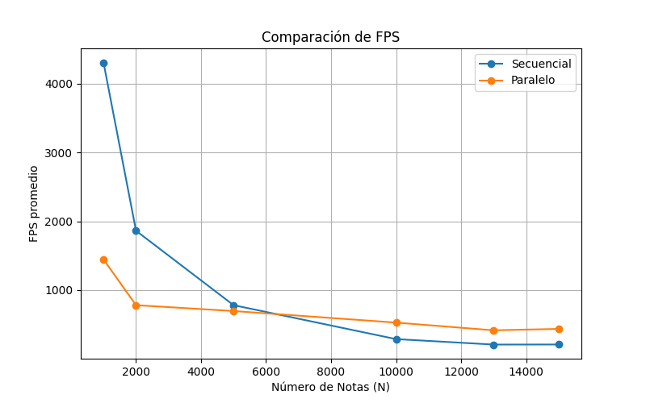
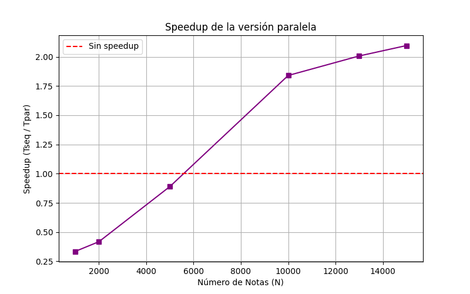
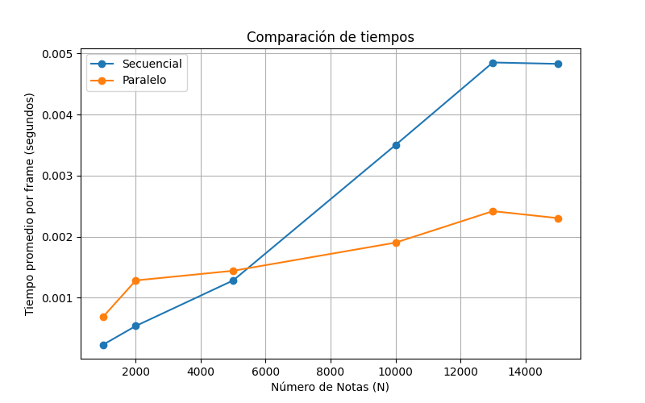

# Informe de Proyecto: Simulación de Animación de Screensaver con Notas Musicales
- Mónica Salvatierra 22249
- Paula Barillas 22764
- Derek Arreaga 22537

---
## Descripción del Proyecto
Este proyecto implementa una simulación de animación inspirada en un screensaver, donde notas musicales se representan como círculos coloreados con plicas y banderas (según su tipo: media, negra, corchea o semicorchea). Estas notas se organizan en los siguientes patrones geométricos:
* corazones
* flores
* lemniscatas
* espirales
* estrellas
* ondas senoidales
* burbujas con física de colisiones

La animación incluye transiciones suaves entre figuras, efectos de color arcoíris y animaciones pulsantes, usando SDL para renderizado gráfico.


El objetivo principal de este proyecto es comparar dos implementaciones:

- **Versión **secuencial** ([main_seq.c](src/main_seq.c), [entities_seq.c](src/entities_seq.c)):** Ejecuta todos los cálculos en un solo hilo.
- **Versión paralela ([main_par.c](src/main_par.c), [entities_par.c](src/entities_par.c)):** Utiliza **OpenMP** para paralelizar cálculos intensivos, como el manejo de colisiones en el patrón de burbujas y la actualización de notas.
---
## Estructura del Código
El proyecto se compone de los siguientes archivos:
```bash
.
├── graphs                  # Gráficas generadas
│   ├── fps.png
│   ├── speedup.png
│   └── tiempos.png
├── include                 # header de entities
│   └── entities.h
├── scripts                 
│   ├── comp.sh             # Ejecución para varios N en amboas versiones
│   ├── plot_speedup.py     # Generación de gráficos comparativos
│   └── speedup.sh          # Ejecución para cálculo simple de speedup
├── src
│   ├── entities_par.c      # Generación de figuras en paralelo
│   ├── entities_seq.c      # Generación de figuras secuencial
│   ├── main_par.c          # Ejecución en paralelo
│   └── main_seq.c          # Ejecución secuencial
├── Makefile                # Generación de ejecutables
├── out_par.txt             # Output temporal de paralelo
├── out_seq.txt             # Output temporal de secuencial
├── resultados.csv          # Output de scripts/comp.sh
├── screensaver_par         # Ejecutable Paralelo
└── screensaver_seq         # Ejecutable Secuencial
```
Archivos Principales

- **[main_seq.c](src/main_seq.c)**: Programa principal para la versión **secuencial**. Inicializa **SDL**, maneja el bucle principal, renderiza un fondo de gradiente y actualiza N notas secuencialmente.

- **[main_par.c](src/main_par.c)**: Programa principal para la versión **paralela**. Similar a ``main_seq.c,`` pero paraleliza la actualización de notas con ``#pragma omp parallel for``.
- **[entities_seq.c](src/main_par.c)**: Contiene funciones para inicializar notas, calcular posiciones de figuras (corazón, flor, etc.) y simular colisiones en el patrón de burbujas de forma secuencial.

- **[entities_seq.c](src/main_seq.c)**: Similar a ``entities_seq.c``, pero optimiza el patrón de burbujas dividiendo el cálculo de colisiones en dos fases paralelas para evitar condiciones de carrera.

---
## Diferencias entre Versiones

- **Secuencial**:
    - ``note_update_creative``: Bucle for estándar sobre todas las notas.
        ```c
        double t0 = omp_get_wtime();
        for (int i=0; i<N; ++i) {
            note_update_creative(&notes[i], i, N, t_seconds, WINDOW_W, WINDOW_H);
        }
        double t1 = omp_get_wtime();
        ```
    - ``figure_bubbles``: Calcula colisiones en un loop $\bold{O(N^2)}$, actualizando posiciones y velocidades directamente. Incluye rebotes con bordes.
    ```c
    void figure_bubbles(Note *notes, int N, int i, int w, int h, float t_seconds) {
    Note *n = &notes[i];
    // Movimiento, rebotes y colisiones con otras notas
    ...
    }
    ```


- **Paralela**:
    - ``note_update_creative``: Paralelizado con ``#pragma omp parallel for`` en [main_par.c](src/main_par.c), distribuyendo la actualización de notas entre hilos.
        ```c
        double t0 = omp_get_wtime();
        #pragma omp parallel for
        for (int i=0; i<N; ++i) {
            note_update_creative(&notes[i], i, N, t_seconds, WINDOW_W, WINDOW_H);
        }
        double t1 = omp_get_wtime();
        ```
    - ``figure_bubbles``: Usa dos fases paralelas para evitar race conditions. No simula velocidades ni rebotes con bordes, enfocándose en repulsión estática.
        ```c
        void figure_bubbles(Note *notes, int N, int w, int h) {
            float *dx = calloc(N, sizeof(float));
            float *dy = calloc(N, sizeof(float));

            #pragma omp parallel for schedule(static)
            for (int i = 0; i < N; i++) {
                for (int j = 0; j < N; j++) {
                    if (i == j) continue;
                    ...
                    dx[i] += force * dx_ij;
                    dy[i] += force * dy_ij;
                }
            }

            #pragma omp parallel for schedule(static)
            for (int i = 0; i < N; i++) {
                notes[i].x += dx[i];
                notes[i].y += dy[i];
                ...
            }
            free(dx); free(dy);
        }
        ```
---

## Aplicación del Modelo PCAM
El modelo PCAM se aplicó principalmente en la paralelización de figure_bubbles ([entities_par.c](src/entities_par.c)) y note_update_creative ([main_par.c](src/main_par.c)).

1. **Partitioning**
    - En ``figure_bubbles``:
        * Tarea: Calcular fuerzas de repulsión para cada nota i basadas en interacciones con todas las notas j ≠ i.
        * Partición: Cada iteración i (cálculo de fuerzas para una nota) es una tarea independiente en términos de lectura (posiciones de j). Escrituras se manejan en arrays temporales (dx, dy) para evitar conflictos.
    - En ``note_update_creative``:
        - Tarea: Actualizar posición, radio y color de cada nota i.
        - Partición: Cada nota i es una tarea independiente, ya que las actualizaciones no dependen de otras notas (excepto en figure_bubbles).


2. **Communication**
    - En ``figure_bubbles``:
        - Datos compartidos: Lectura de posiciones (x, y) de todas las notas. Escrituras en dx[i], dy[i] son locales a cada i, evitando race conditions. La aplicación de correcciones en la fase 2 lee dx, dy y escribe en notes[i].x, notes[i].y.
        - Sincronización: OpenMP inserta barreras implícitas entre las fases 1 y 2 para garantizar que todas las fuerzas se calculen antes de aplicar correcciones.
    - En ``note_update_creative``:
        - Datos compartidos: Solo lectura de parámetros globales (t_seconds, w, h). Escrituras en notes[i] son locales a cada i.
        - Sincronización: Barrera implícita al final del loop paralelo.


3. **Agglomeration**
    - En ``figure_bubbles``:
        - Agrupación: En lugar de paralelizar cada interacción i-j (O(N²) tareas, alto overhead), se aglomeran tareas por i, resultando en N tareas distribuidas en dos loops paralelos (fuerzas y correcciones).
        - Optimización: Uso de schedule(static) para asignar iteraciones de forma equilibrada, minimizando overhead y sincronizaciones.


    - En ``note_update_creative``:
        - Agrupación: N tareas (una por nota) se distribuyen en un solo loop paralelo, balanceando la carga entre hilos.
        - Optimización: La simplicidad de las operaciones por nota reduce el overhead de paralelización.

4. **Mapping**
    * En ambas funciones:
        - Asignación: OpenMP asigna iteraciones a hilos disponibles según el número de cores. schedule(static) asegura distribución equitativa.
        - Consideraciones: No se especifica thread affinity, confiando en el scheduler de OpenMP. Para N grande, el mapeo es eficiente hasta saturar los cores disponibles.

La paralelización de ``note_update_creative`` mejora el rendimiento general, mientras que la de ``figure_bubbles`` aborda específicamente el caso $\bold{O(N^2)}$, logrando speedups significativos para N grande.

---

## Requisitos y Ejecución

* **Dependencias**: SDL2, SDL2_ttf, OpenMP, GCC.
* **Sistema**: Linux/Unix con fuentes TrueType (e.g., DejaVuSans.ttf).
* **Compilador**: GCC con soporte para OpenMP (-fopenmp).

### Cómo Compilar y Ejecutar

Este proyecto ofrece varias formas de ejecución para probar el rendimiento y comparar las versiones secuencial y paralela.

---

#### Ejecución Individual

Para ejecutar las versiones secuencial y paralela de forma independiente, sigue estos pasos:

1.  Compila el proyecto:

    ```bash
    make all
    ```

    Este comando compila ambos archivos ejecutables: `screensaver_seq` y `screensaver_par`.

2.  Ejecuta la versión secuencial:

    ```bash
    ./screensaver_seq <N>
    ```

    Reemplaza `<N>` por el número de puntos a procesar. Por ejemplo: `./screensaver_seq 1000000`.

3.  Ejecuta la versión paralela:

    ```bash
    ./screensaver_par <N>
    ```

    Reemplaza `<N>` por el número de puntos a procesar. Por ejemplo: `./screensaver_par 1000000`.

---
#### Ejecución en conjunto

El proyecto incluye un script para automatizar la ejecución de ambas versiones y poder comparar los resultados con cierto valor de `<N>` dado.

1.  **Limpiar y compilar el proyecto**:

    ```bash
    make clean
    make all
    ```

    Esto asegura que el proyecto se compile desde cero.

2.  **Otorgar permisos al script de pruebas**:

    ```bash
    chmod +x scripts/speedup.sh
    ```

    Este comando hace que el script `speedup.sh` sea ejecutable.

3.  **Ejecutar las pruebas**:

    ```bash
    ./scripts/speedup.sh
    ```

    Este script ejecutará ambas versiones con un único valor de <N>, medirá los tiempos de ejecución y guardará los resultados en los archivos `out_par.txt` y `out_seq.txt`.

---

#### Ejecución de las Pruebas de Comparación (`comp.sh`)

Este método permite ejecutar las versiones secuencial y paralela con una variedad de tamaños de datos (`N`), guardar los resultados en un archivo `resultados.csv` y luego generar una gráfica para visualizar el **speedup** (aceleración).

1.  **Limpiar y compilar el proyecto**:

    ```bash
    make clean
    make all
    ```

    Esto garantiza que el proyecto se compile desde cero antes de las pruebas.

2.  **Dar permisos al script de comparación**:

    ```bash
    chmod +x scripts/comp.sh
    ```

    Este comando hace que el script `comp.sh` sea ejecutable.

3.  **Ejecutar las pruebas de comparación**:

    ```bash
    ./scripts/comp.sh
    ```

    Este script ejecutará ambas versiones con múltiples valores de `N`, medirá los tiempos de ejecución y guardará todos los datos en el archivo `resultados.csv`.

-----

#### **Generación de Gráficas de Rendimiento**

Una vez que se generó el archivo `resultados.csv`, se utiliza ``Python`` para generar una gráfica de aceleración.

1.  **Configurar el entorno de Python**:

    ```bash
    sudo apt install python3.12-venv
    python3 -m venv my_env
    source my_env/bin/activate
    ```

    Estos comandos instalan el módulo `venv`, crean y activan un entorno virtual.

2.  **Instalar las librerías necesarias**:

    ```bash
    pip install pandas matplotlib
    ```

    Necesitas **pandas** para manipular los datos del CSV y **matplotlib** para crear la gráfica.

3.  **Generar la gráfica**:

    ```bash
    python3 scripts/plot_speedup.py resultados.csv
    ```

    Esto ejecutará el script que lee los datos y genera la visualización.

4.  **Desactivar el entorno virtual**:
    Cuando se haya terminado de trabajar con las librerías, se desactiva el entorno con:

    ```bash
    deactivate
    ```
---

## Resultados de Rendimiento
Ejecutando `scripts/plot_speedup.py`, se obtuvieron los siguientes resultados (los valores exactos dependen del hardware):


| N      | Tiempo Secuencial (s) | Tiempo Paralelo (s) | Speedup | FPS Secuencial | FPS Paralelo |
|--------|-----------------------|---------------------|---------|----------------|--------------|
| 1000   | 0.000144              | 0.000274            | 0.525   | 6944.44        | 3649.63      |
| 2000   | 0.000288              | 0.000430            | 0.669   | 3472.22        | 2325.58      |
| 5000   | 0.000737              | 0.000534            | 1.380   | 1356.85        | 1872.65      |
| 10000  | 0.001452              | 0.001071            | 1.355   | 688.70         | 933.70       |
| 13000  | 0.002844              | 0.001180            | 2.410   | 351.61         | 847.45       |
| 15000  | 0.002271              | 0.001495            | 1.519   | 440.33         | 668.89       |

### Gráficas Generadas

#### **Comparación de FPS**


* A partir de **N=5000**, la versión paralela muestra un mayor FPS promedio. Esto indica que, en el mismo tiempo, la versión paralela puede procesar más cuadros por segundo, lo que se traduce en un rendimiento superior para el usuario.

#### **Comparación de Speedup**


* **Valores iniciales (N = 1000, 2000)**: Para un número pequeño de notas (1,000 y 2,000), el **speedup es menor a 1** (0.525 y 0.669). Esto significa que la versión **paralela es más lenta** que la secuencial. La razón principal es el overhead de la paralelización, que incluye la creación de hilos, la sincronización y la comunicación. Para tareas muy pequeñas, este costo extra supera cualquier beneficio que la paralelización podría ofrecer.

* **Punto de inflexión (N = 5000)**: A partir de 5,000 notas, el **speedup supera 1** (1.380). Este es el punto en el que el beneficio de la ejecución paralela comienza a compensar el overhead. A medida que la carga de trabajo aumenta, la paralelización se vuelve más eficiente.

* **Pico y descenso (N = 13000, 15000)**: La aceleración alcanza un pico notable en **N = 13,000** con un valor de ``2.410``. Sin embargo, en **N = 15,000**, el speedup disminuye a ``1.519``. Este comportamiento no lineal puede ser causado por varios factores, como un mayor overhead de sincronización entre hilos o incluso por contención de recursos del sistema (como la caché o la memoria) cuando el número de tareas se incrementa demasiado.

#### **Comparación de Tiempos**

* La curva de la versión paralela se mantiene consistentemente por debajo de la secuencial a partir de **N=5000**. Esto valida el análisis del speedup: el tiempo de ejecución paralelo es menor cuando la carga de trabajo es suficiente.


## Conclusiones

Los resultados muestran que la versión **paralela** supera a la **secuencial** en **rendimiento (FPS y tiempo de ejecución)** a partir de ``N=5000``, con un **speedup** de ``1.380``, indicando que la paralelización comienza a compensar el overhead. El **speedup** alcanza un pico de ``2.410`` en ``N=13000``, reflejando una alta eficiencia en tareas intensivas como el cálculo de colisiones en ``figure_bubbles``. Sin embargo, en ``N=15000``, el **speedup** disminuye a ``1.519,`` posiblemente por contención de recursos o sincronización. Para **``N``** pequeño (1000, 2000), la versión paralela es más lenta (speedup < 1) debido al overhead de paralelización. La versión paralela logra mayor FPS a partir de N=5000, mejorando la fluidez visual. Estos resultados validan la efectividad de la paralelización con OpenMP para cargas de trabajo grandes, aunque el rendimiento no escala linealmente debido a limitaciones como sincronización y recursos del sistema.